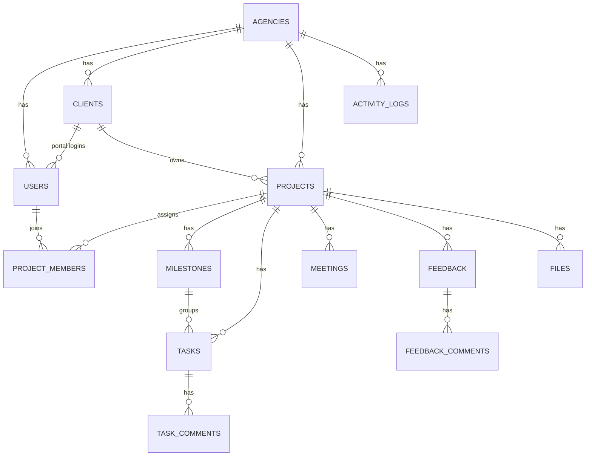

# 03 — Data Model (MySQL 8 + Prisma)

## ERD

## Conventions
- IDs: `CHAR(36)` UUID (avoids guessable IDs). Timestamps: `created_at`, `updated_at`.
- Every tenant table has `agency_id` + index. Composite indexes start with `agency_id`.
- Soft delete not used in MVP (hard delete with FK cascade where safe).

## Tables
**agencies**: id, name, slug (unique), owner_name, contact_email, contact_phone, status ENUM(ACTIVE,SUSPENDED), plan ENUM(FREE,PRO) default FREE, suspended_reason, created_at

**users**: id, agency_id (nullable), client_id (nullable), name, email (unique), password_hash, role ENUM(SUPER_ADMIN,AGENCY_ADMIN,AGENCY_MEMBER,CLIENT), is_active, last_login_at
 - Constraint (app-level + CHECK): SUPER_ADMIN → agency_id null; CLIENT → client_id not null.

**clients**: id, agency_id, company_name, contact_name, email, phone, notes

**projects**: id, agency_id, client_id, manager_id (user), name, description, status ENUM(PLANNING,ACTIVE,ON_HOLD,COMPLETED), priority ENUM(LOW,MEDIUM,HIGH), start_date, due_date
 - `progress` is NOT stored; computed.

**project_members**: id, agency_id, project_id, user_id — unique(project_id, user_id)

**milestones**: id, agency_id, project_id, title, description, due_date, status ENUM(PENDING,IN_PROGRESS,DONE), sort_order, requires_client_approval, approval_status ENUM(NONE,PENDING,APPROVED,CHANGES_REQUESTED), approved_by, approved_at

**tasks**: id, agency_id, project_id, milestone_id (nullable), title, description, assignee_id, status ENUM(TODO,IN_PROGRESS,REVIEW,DONE,CANCELLED), priority ENUM(LOW,MEDIUM,HIGH,URGENT), due_date, completed_at, created_by

**task_comments**: id, agency_id, task_id, author_id, body

**meetings**: id, agency_id, project_id, title, meeting_date, notes (TEXT), visible_to_client, ai_summary (JSON, nullable), created_by

**feedback**: id, agency_id, project_id, client_id, submitted_by (user), title, description, status ENUM(OPEN,IN_REVIEW,IN_PROGRESS,RESOLVED,DECLINED)

**feedback_comments**: id, agency_id, feedback_id, author_id, body

**files**: id, agency_id, project_id, task_id (nullable), feedback_id (nullable), uploaded_by, original_name, storage_key (UUID), mime_type, size_bytes, visible_to_client
 - Exactly one context: project (always set) + optional task/feedback.

**activity_logs**: id, agency_id (nullable for platform events), actor_type ENUM(USER,CLIENT,SYSTEM,SUPER_ADMIN), actor_id, event_type (e.g. `task.completed`), entity_type, entity_id, project_id (nullable), visible_to_client, metadata JSON, created_at
 - Indexes: (agency_id, created_at), (project_id, created_at).

## Derived values
- **Project progress** = DONE tasks / (all tasks − CANCELLED) × 100; 0 if no tasks.
- **Overdue task** = due_date < today AND status NOT IN (DONE, CANCELLED).
- **Due soon** = due within next 7 days.
- **Pending client actions** = milestones with approval_status=PENDING + feedback awaiting client reply.

## Event types
`agency.created`, `agency.suspended`, `agency.activated`, `support.entered`, `support.exited`, `user.created`, `client.created`, `project.created`, `project.status_changed`, `milestone.completed`, `milestone.approved`, `task.created`, `task.completed`, `meeting.recorded`, `meeting.ai_summarized`, `feedback.submitted`, `feedback.status_changed`, `file.uploaded`

## Seed data
- Super Admin: 1
- Agency A ("Pixel Forge Studio") and Agency B ("Northwind Digital"): 1 admin + 2 members each, 2 clients each with 1 portal user, 2–3 projects per client, mixed task states (incl. overdue), meetings, feedback, a few files.
